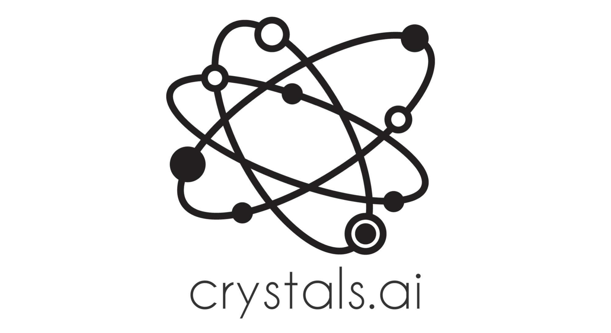

[crystals.ai](http://crystals.ai) is dedicated to the application of artificial intelligence techniques to materials science. Here, you will find a collection of models, tools and datasets to aid users and researchers in using and developing AI techniques for materials science.

If you feel that there are any missing items, please feel free to fork the [repo for this website](http://github.com/materialsvirtuallab/crystals.ai) to make changes and submit a pull request.

## Models

* [MEGNet](https://megnet.crystals.ai). Various MatErials Graph Network (MEGNet) models for predicting the formation energies, band gaps, elastic constants and other properties of crystals. 
* [Deep Neural Network](https://dnn.crystals.ai): Deep neural networks trained for rapid formation energy prediction of garnets and perovskites.

## Tools

* [MEGNet](https://github.com/materialsvirtuallab/megnet)
* [matminer](https://github.com/hackingmaterials/matminer)

## Data Sets

This is a compilation of 

* <a href="https://figshare.com/articles/Graphs_of_materials_project/7451351" target="_blank">Graphs of Materials Project v2018.6.1</a>

## Contact

Please contact the [Materials Virtual Lab](http://www.materialsvirtuallab.org), the maintainer of this site, if you have any feedback or questions.
